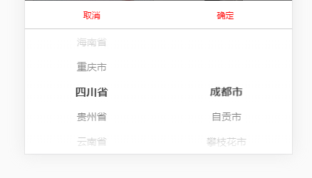

#### 初始化

```
//目前仅支持vue
import AreaCity form 'areaCity';

const areaCity = new AreaCity({
    //参数全部为可选
    area: obj.area || area, // 二级联动数据源 需要其他的二级联动数据时
    province: obj.province || null,//一级默认选中项
    city: obj.city || null,// 二级默认选中项 非必传 传默认一级 不传默认二级  二级默认选择 首项
    // 例子 [{"province": "北京市","city": [{"name": "北京市"]}]
    provinceKey: obj.provinceKey || 'province',//一级key
    cityArrayKey: obj.cityArrayKey || 'city',//二级 数组的key
    cityKey: obj.cityKey || 'name',//二级数组的中要展示的key
})
```


#### 获取状态以及选中项

```

const areaCity = new AreaCity();

areaCity().then(({action,getSelect}) =>{
    //getSelect 是一个数组
    if (action === 'comfir') {
        const [ province,city ] = getSelect;
    }
});


```


#### 销毁
```
ps: new 之后才会有销毁
areaCity && areaCity.destroyed && areaCity.destroyed();

```


